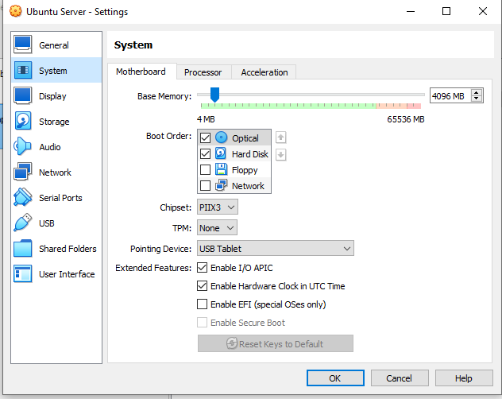
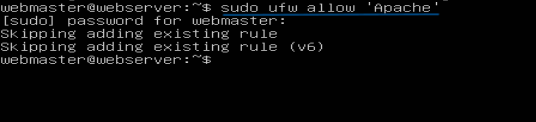

# Deliverable 2

## 1. What are the server hardware specifications (virtual machine settings)? Take a screenshot - don’t type it!

 
 

## 2. What is Ubuntu server log in screen? Take screenshot - do not type it!

 

## 3. What is the IP address of your Ubuntu Server Virtual Machine?

IP address: 192.168.2.211  

 

## 4. How do you enable the Ubuntu Firewall?

`sudo ufw enable`

 

## 5. How do you check if the Ubuntu Firewall is running?

`sudo ufw status`

 

## 6. How do you disable the Ubuntu Firewall?

`sudo ufw disable`

 

## 7. How do you add Apache to the Firewall?

`sudo ufw allow 'Apache'`

 

## 8. What is the command you used to install Apache?

`sudo apt install apache -y`

 

## 9. What is the command you use to check if Apache is running?

`sysemctl status apache2 --no-pager`

 

## 10. What is the command you use to stop Apache?

`sudo systemctl stop apache2`

 

## 11. What is the command you use to restart Apache?

`sudo systemctl restart apache2 ssh`

 

## 12. What is the command used to test Apache configuration?

`sudo apachectl -t`

 

## 13. What is the command used to check the installed version of Apache? 

`sudo apache2 -y`

 

## 14. What are the most common commands to troubleshoot Apache errors? Provide a brief description of each command.

`systemctl` - Used to control and interact with Linux services via the `systemd` service manager. The `systemctl` command will query `systemd` for the state of Apache’s processes.
`journalctl` - Used to query and view the logs that are generated by `systemd`. `journalctl` displays logs from `systemd` that describe the Apache service itself, from startup to shutdown, along with any process errors that may be encountered along the way.
`apachectl` - When troubleshooting, this command is used to check Apache’s configuration. `apachectl` is an invaluable tool to help detect and diagnose Apache configuration problems.   

## 15. Which are Apache Log Files, and what are they used for? Provide examples and screenshots.

`sudo tail -n 2 /var/log/apache2/error.log`

 

## Deliverable 2 Result

 