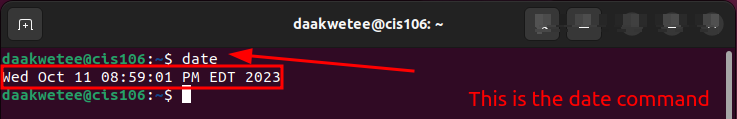
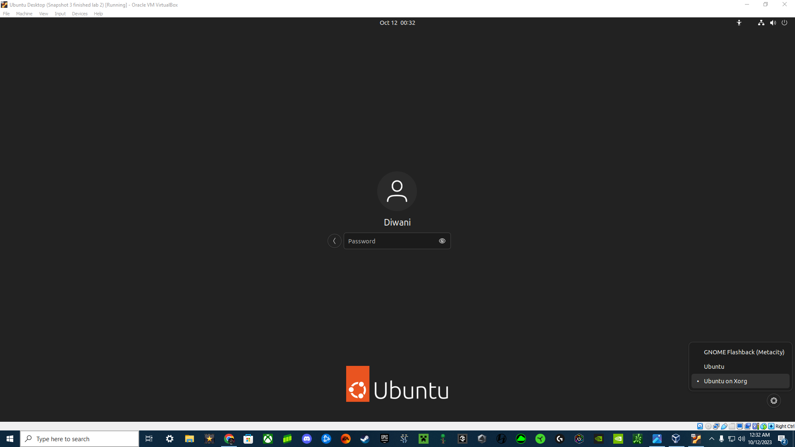

----
Name: Diwani Akwetee
Course: CIS 106
Semester: Fall 2023
----

# Lab 3 Submission 

## Question 1 

## Question 2

## Question 3

| Program purpose     | Package Name     | Version            |
| ------------------- | ---------------- | ------------------ |
| Play a tetris game  | Blockattack      | 2.7.0-1            |
| Play a video file   | Dragonplayer     | 4:21.12.3-0ubuntu1 |
| Browse the internet | Epiphany-Browser | 42.0.4-0ubuntu1    |
| Read your email     | Balsa            | 2.6.3-1            |
| Play music          | Lollypop         | 1.4.33-1           |

## Question 4
| Command | What it does                                                                                                                                                                  |
| ------- | ----------------------------------------------------------------------------------------------------------------------------------------------------------------------------- |
| echo    | Displays a line of text                                                                                                                                                       |
| fortune | Prints a random, hopefully interesting, adage or epigram                                                                                                                      |
| cowsay  | Generates an ASCII picture of a cow saying something provided by the user                                                                                                     |
| lolcat  | A program that concatenates files, or standard input, to standard output, and adds rainbow coloring to it.                                                                   |
| figlet  | Display large characters made up of ordinary screen characters                                                                                                                |
| toilet  | Displays large colorful     characters                                                                                                                                        |
| rig     | A utility  that  will piece together a random first name, last name, street number and address, along with a geographically consistant city, state, ZIP code, and area code. |