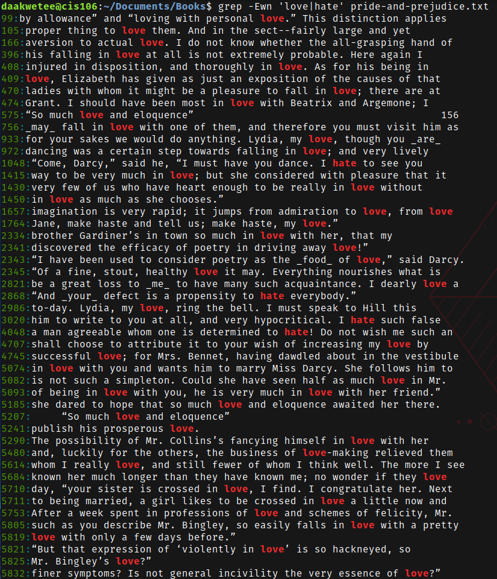
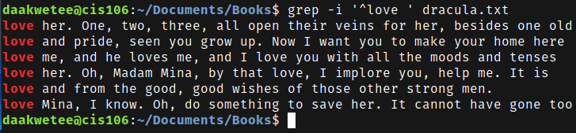
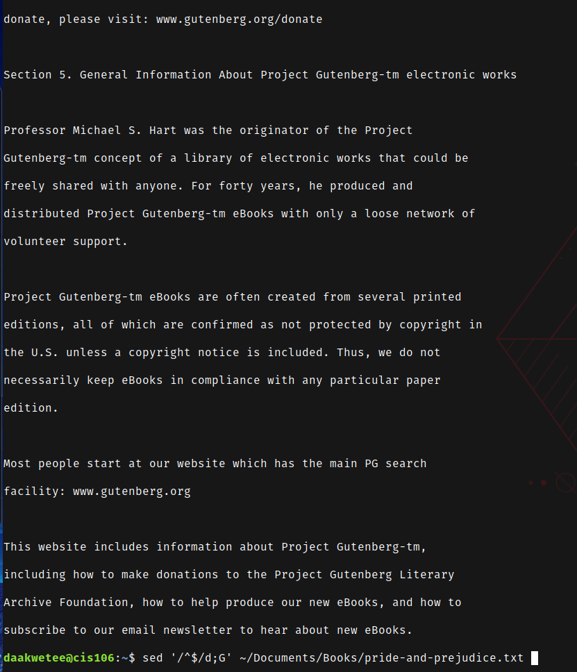

----
Name: Diwani Akwetee
Course: CIS 106
Semester: Fall 2023
----

# Lab 7 Submission 

## Question 1
 
 
 
 

## Question 2
 
 
 
 
 

## Question 3
 
 
 

## Question 4
 
 
 
 
 
 
 

## Question 5
 
 
 
 
 
 
 
 

## Question 6
 

## Challenge Question 
 
 
 
 