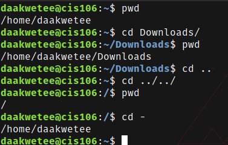
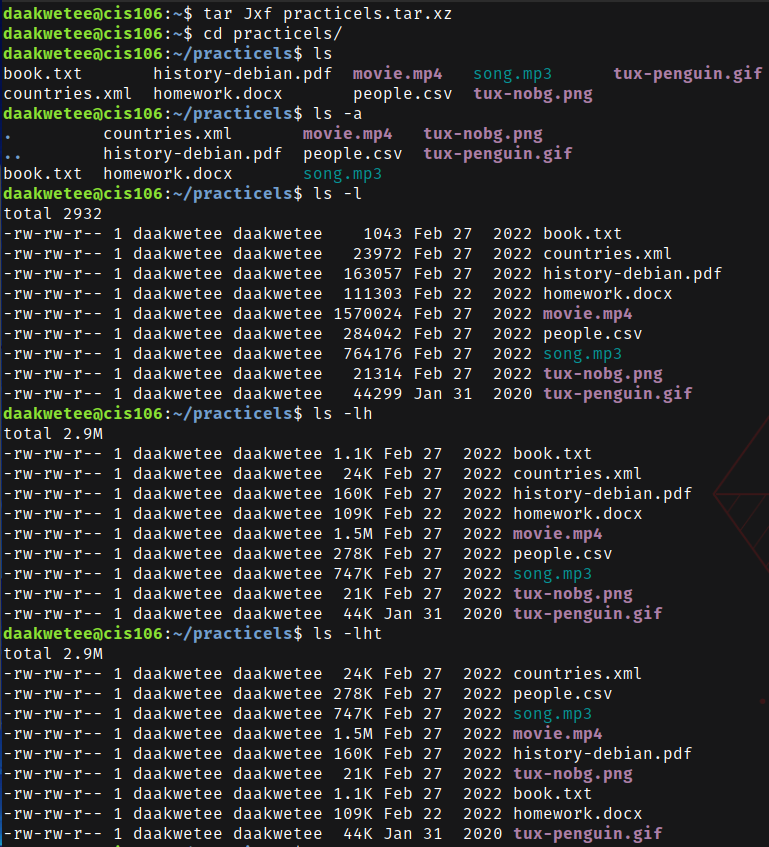
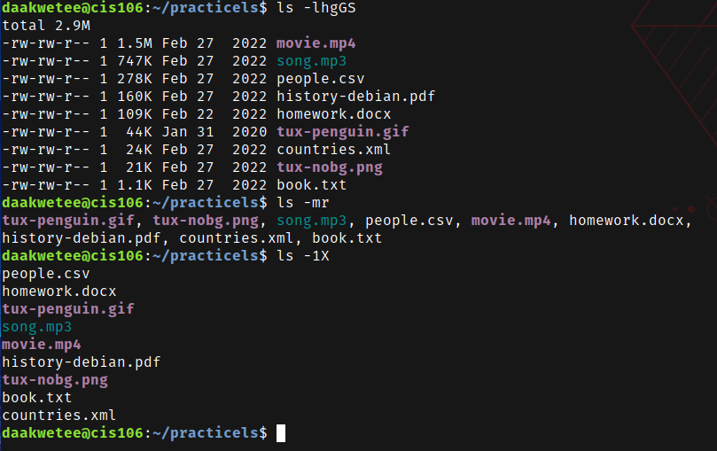
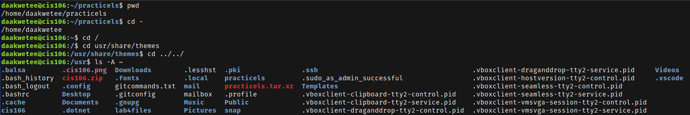
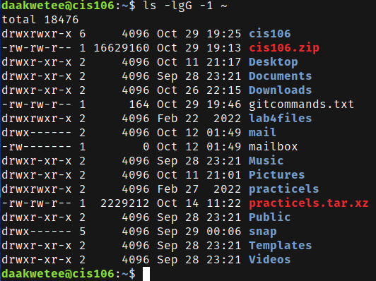
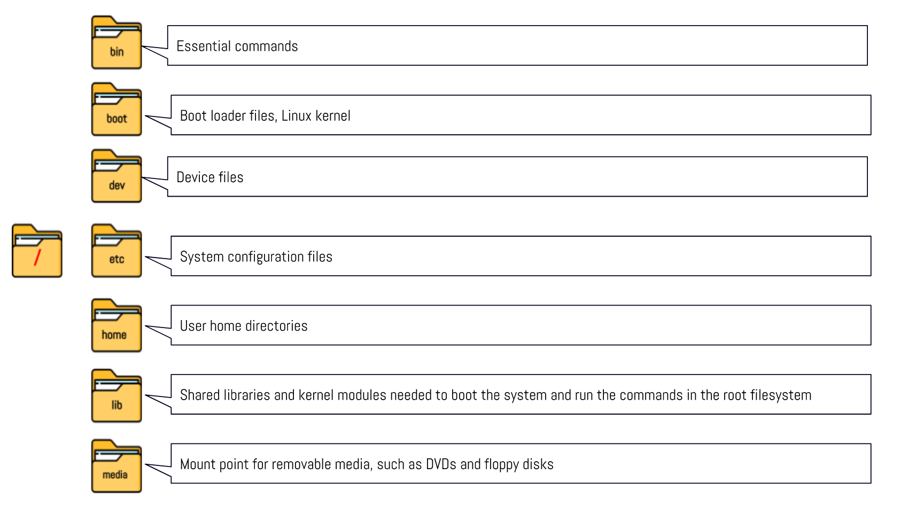
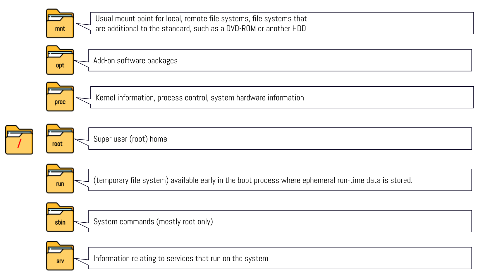
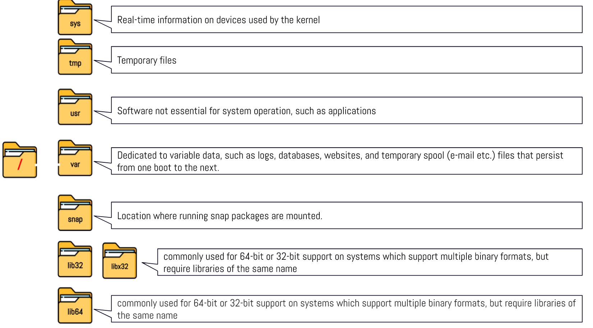

----
Name: Diwani Akwetee
Course: CIS 106
Semester: Fall 2023
----

# Week Report 4

## Practice from the presentation The Linux File system: 
### Practice 1
 

### Practice 2
 
 

### Challenge Question
 
 
 

## The Linux File system directories and their purpose: 
 
 
 

## All the commands for navigating the filesystem 

| Command | What it does                                | Syntax                        | Example        |
| ------- | ------------------------------------------- | ----------------------------- | -------------- |
| pwd     | Prints current directory                    | `pwd`                         | `pwd`          |
| cd      | Changes your current directory              | `cd` + `destination`          | `cd Downloads` |
| ls      | list all the files in the current directory | `ls` + `option` + `directory` | `ls -a`        |

## Basic terminology 
* **File system:** The way files are store and managed.  
* **Current directory:** The directory you are presently at. 
* **parent directory:** A particular directory that contains folders or subdirectories.
* **the difference between your home directory and the home directory:** Your home directory is associated with the users account, while the home directory is associated with the root user which is the administrator of your system. 
* **pathname:** The location of the file in the filesystem. 
* **relative path:** The location of a file starting from the current working directory that is located inside the current working directory. 
* **absolute path:** The location of a file starting at the root of the file system. 
