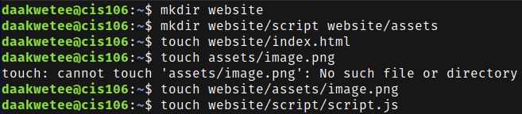
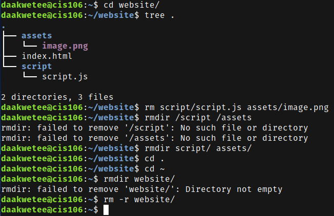
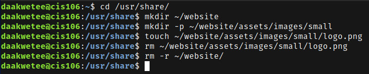
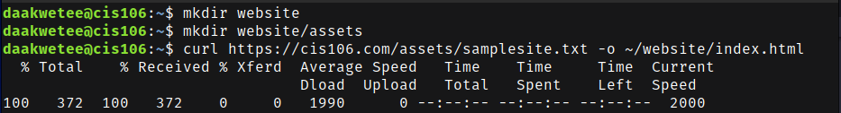
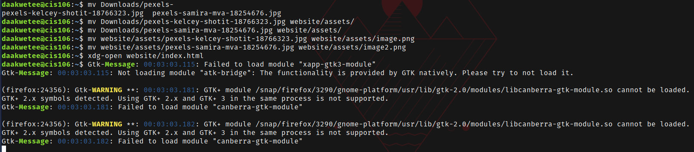
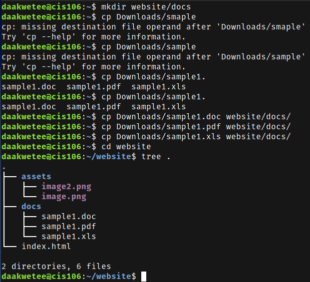

----
Name: Diwani Akwetee
Course: CIS 106
Semester: Fall 2023
----

# Week Report 5

## Questions
* **What are Command Options?**
Command options are used to modify or enhance the behavior of the command. 

* **What are Command Arguments?**
Command arguments are items the command acts on. 

* **Which command is used for creating directories? Provide at least 3 examples.**
The command used for making directories is `mkdir`. 
  * Examples: 
    * `mkdir wallpapers` 
    * `mkdir wallpapers/ocean` 
    * `mkdir videos/'gaming clips'`  
  
* **What does the touch command do? Provide at least 3 examples.**
The `touch` command creates files.
  * Examples:
    * `touch list`
    * `touch ~/Downloads/games.txt`
    * `touch "list of foods.txt"`

* **How do you remove a file? Provide an example.**
The command for removing a file is `rm`. 
  * Example:
    * `rm Downloads/games` 

* **How do you remove a directory and can you remove non-empty directories in Linux? Provide an example.**
The command to remove a directory is `rmdir`. Yes you can remove a non-empty directory and the command to remove it is `rm -r`.
  * Examples:
    * `rmdir Downloads/games`
    * `rm -r Downloads/games`
  
* **Explain the mv and cp command. Provide at least 2 examples of each.**
  * The `mv` command moves and renames directories. The source is the file or directory you want to move and the destination is where the directory or file is going. 
    * Formula: 
      * mv + source + destination  
    * Example: 
      * `mv Downloads/homework.pdf Documents/` 
      * `mv games/ wallpapers/ rockmusic/ /media/student/flashdrive/`

  * The `cp` command copies files or directories from a source to a destination.  
    * Formula:
      * cp + files to copy + destination 
    * Example: 
      * `cp Downloads/wallpapers.zip Pictures/`
      * `sudo cp -r script.sh program.py home.html assets/ /var/www/html/`

## Practice 1
 
 

## Practice 2
 

## Practice 3
 
 

## Practice 4
 