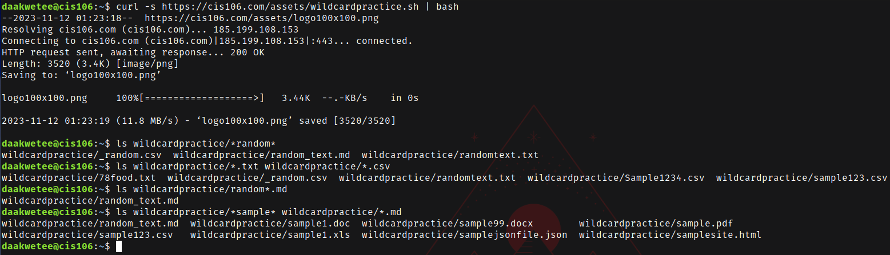
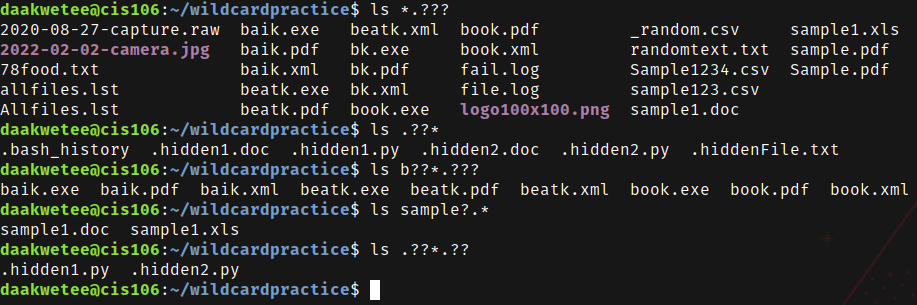
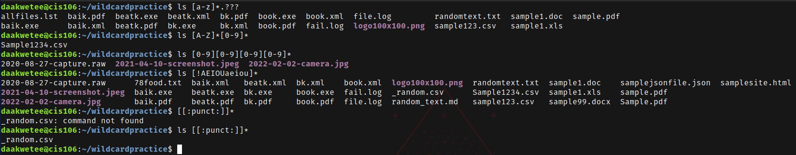

----
Name: Diwani Akwetee
Course: CIS 106
Semester: Fall 2023
----

# Week Report 6

## Wildcards

### * Wildcard
The * wildcard matches from 0 to any number of characters. 
* Examples: 
  * List all the text files in a directory 
    * `ls *.txt`  
  * List all the files that start with the word file
    * `ls file*`
  * Copy all the mp4 files
    * `cp Downloads/*.mp4 ~/Videos/Movies/`   

### ? Wildcard
The ? wildcard matches a single character. 
* Examples: 
  * List all the files hidden files in the current directory:
    * `ls ../.??*` 
  * List all the files that have 2 characters between letter b and k:
    * `ls b??k*`  
  * List all the files that have a 3 letter file extension:
    * `ls *.???`   

###  [] Wildcard
The [] wildcard matches a single character to a set. 
* Examples: 
  * Match all files that have a vowel after letter f:
    * `ls f[aeiou]*`
  * Match all files that have a range of letters after f:
    * `ls f[a-z]*`
  * Match all files whose name begins with any 3 combination of numbers and the current user's username:
    * `ls [0-9][0-9][0-9]$USER`      

### Brace Expansion 
The brace expansion is not a wild card but another feature of bash that allows you to generate arbitrary strings to use with commands.
* Examples: 
  * Create a whole directory structure in a single command: 
    * `mkdir -p music/{jazz,rock}/{mp3files,videos,oggfiles}/new{1..3}` 
  * Create a N Number of files use:
    * `touch website{1..5}.html`
  * Remove multiple files in a single directory 
    * `rm -r {dir1,dir2,dir3,file.txt,file.py}`     

## Practice 5
 

## Practice 6
 

## Practice 7 
 

